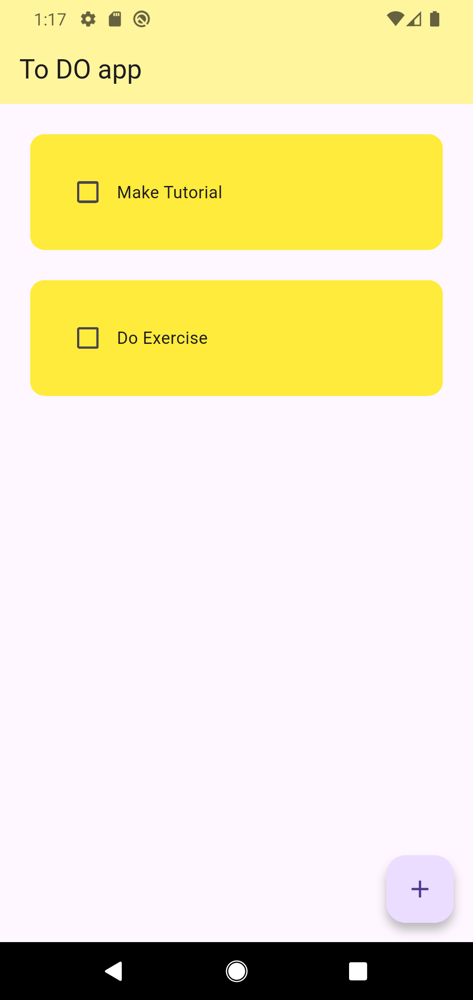
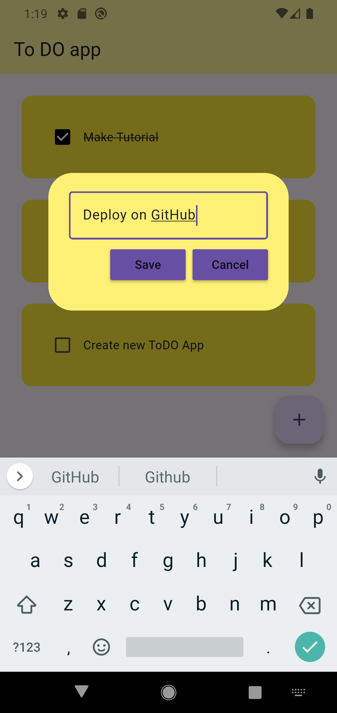
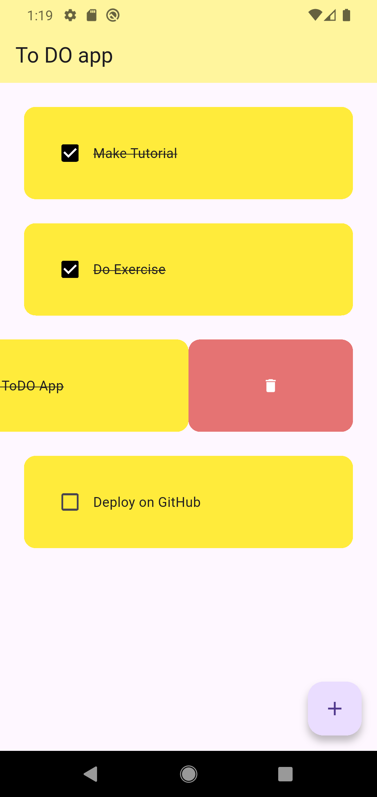
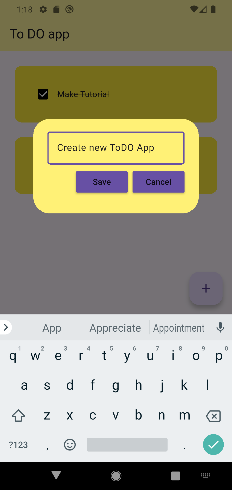

````markdown
# Flutter Todo App 

A modern and responsive Todo application built with Flutter. This project demonstrates local data persistence using Hive and showcases clean UI design with reusable components and interactive task management.

## Features

- Modern and intuitive user interface
- Persistent local storage using Hive
- Responsive layout
- Interactive task management with Slidable widgets
- Reusable and organized code structure
- Lightweight and efficient architecture

## Tech Stack

- Flutter
- Dart
- Hive
- flutter_slidable

## Screenshots

Below are screenshots showcasing the application's interface and functionality.

| | |
|---|---|
|  |  |
|  |  |
|  |  |
|  | |

## Project Structure

```text
lib/
├── data/
├── pages/
├── utils/
├── widgets/
└── main.dart
```

## Getting Started

### Clone the repository

```bash
git clone https://github.com/MuhammadFurqanoffical/flutter-todo-app.git
```

### Navigate to the project directory

```bash
cd flutter-todo-app
```

### Install dependencies

```bash
flutter pub get
```

### Run the application

```bash
flutter run
```

## Dependencies

```yaml
dependencies:
  flutter:
    sdk: flutter
  hive:
  hive_flutter:
  flutter_slidable:
```

## About

This project was developed to strengthen Flutter development skills and demonstrate:

- Local storage using Hive
- State management and dynamic UI updates
- Reusable widgets and organized code structure
- Responsive and user-friendly interfaces

## Author

**Muhammad Furqan**

- GitHub: [@MuhammadFurqanoffical](https://github.com/MuhammadFurqanoffical)

---

⭐ If you found this project useful, consider giving it a star.
````
